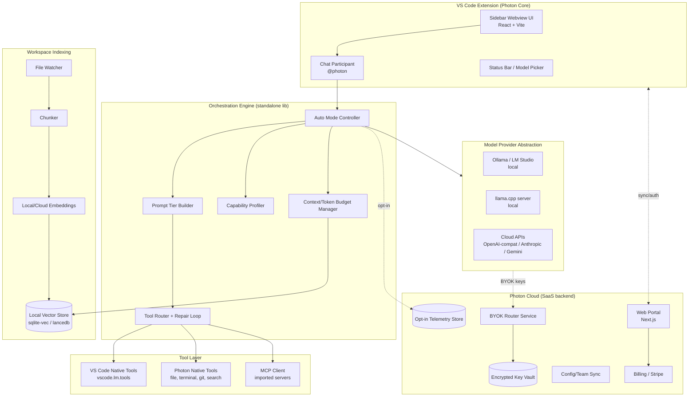

# Photon — From Extension to SaaS
### Strategic + Technical Blueprint

*Compiled July 2026*

---

## PART 0 — TL;DR

Your core insight is correct and, based on the current market, **the timing is unusually good**: GitHub Copilot moved its Pro/Pro+ plans to usage-based "AI Credit" billing in June 2026, Google slashed the Gemini API free tier from 250 to 20 requests/day, and Continue.dev — one of the two extensions people relied on for local-model VS Code work — was acquired by Cursor in June 2026 and is now a dead, read-only repo. That's a real gap opening up at exactly the moment local models (Qwen3-Coder, DeepSeek-Coder-V2-Lite, Devstral) crossed the threshold where an 8–16B model is genuinely usable for real coding work on consumer hardware.

But the idea as currently scoped has **one feature that will get you banned by every provider you integrate and could sink the whole product**: the "router that connects various free models... auto routes requests... maximizes the limits users can use across all models altogether." That's automated free-tier pooling/aggregation, and it sits in the same bucket as key-rotation-to-evade-rate-limits, which every major provider's ToS explicitly prohibits. I'll explain exactly why below and what to build instead that gets you the same user value without the legal exposure.

Everything else — the small-model-first UX, the tiered system prompts, the auto mode, the MCP/skills import, the workspace indexing — is a genuinely good, defensible product direction. Let's build it out.

---

## PART 1 — STRATEGIC ASSESSMENT

### 1.1 Is the pain point real? (Yes — and it's getting worse, not better)

- **Cloud AI pricing is tightening, not loosening, at the consumer edge.** GitHub Copilot's free tier gives 50 premium requests/month; Copilot Pro ($10/mo) and Pro+ ($39/mo) now meter chat/agent/premium-model usage through a monthly credit pool, with overage billed per-request once you're out. Heavy users report exhausting free-tier allowances in days.
- **Free API tiers are shrinking.** Google cut the Gemini API free tier from 250 requests/day to 20/day in December 2025 specifically to "free up compute" for paid demand.
- **The go-to open-source local extension just died.** Continue.dev — the most-cited tool for "model-agnostic, BYOK, local-model-friendly VS Code extension" — was acquired by Cursor; its repo shipped a final release on June 19, 2026 and is now archived/read-only. Its own userbase is actively being told to migrate to Cline or leave the extension model entirely. That is a wide-open lane for exactly the audience you're targeting (local-model, cost-conscious, VS Code-native users).
- **Local models crossed a real capability threshold.** Qwen2.5-Coder 7B still leads fill-in-the-middle autocomplete at that size; Qwen3-Coder, Devstral Small (24B, Apache-2.0), and DeepSeek-Coder-V2-Lite (16B MoE, ~10GB) are now credible for agentic, multi-file coding work on a single consumer GPU or a 16–32GB Apple-silicon Mac. The ceiling has moved from "toy" to "actually useful," which is the precondition for a product like Photon to matter.
- **But the tools built for these small models are second-class citizens.** Cline, Roo Code, and the current Continue fork are all *model-agnostic* — they were designed and tuned against frontier cloud models (Claude, GPT) and bolt on local-model support, not the other way around. Nobody is building the UX, prompts, and tool-calling scaffolding *specifically* to compensate for what small models are bad at. That's your wedge.

**Verdict: the pain point is real, validated by the market's own recent moves, and the specific niche (small-model-first UX) is currently unoccupied.**

### 1.2 Competitive landscape (mid-2026)

| Tool | Model philosophy | Where it beats Photon (as scoped) | Where Photon beats it |
|---|---|---|---|
| **Cline** | Model-agnostic, agent-first, BYOK | Best-in-class autonomous agent loop, huge mindshare inherited from Continue's collapse | Not tuned for weak models at all — assumes strong tool-calling and large context, which small models don't reliably have |
| **Roo Code** | Fork of Cline, safety/approval-focused | Mature approval-gate UX for agentic edits | Same weak-model blind spot as Cline |
| **Continue (post-acquisition)** | Now owned by Cursor, unmaintained as independent OSS | N/A — effectively discontinued | This *is* your opening |
| **Aider** | Terminal-native, git-diff-based | Extremely lightweight, works with tiny context, git-native undo | Not an IDE experience; no VS Code-native UX |
| **GitHub Copilot** | Cloud-only, frontier models | Native VS Code integration, huge distribution, enterprise trust | Expensive, no meaningful local-model story, Microsoft has no incentive to optimize for weak hardware |
| **OpenRouter** (infrastructure, not an IDE tool) | Unified API + auto-router across 20+ free and hundreds of paid models | Already does exactly the "single place to access many models, including free ones" idea, at the API layer, at scale, with legitimate provider relationships | Photon should probably sit *on top of* something like this rather than reinvent it — see 1.4 |
| **Ollama / LM Studio** | Local model runtime only | Own the "run a model locally" layer already | You're not competing with these — you're the IDE-side consumer of them, which is the right positioning |

Nobody currently owns "the VS Code experience purpose-built to make small/local models punch above their weight." That is a legitimate, defensible niche — but it's a *feature and UX* moat, not a technology moat, so expect Cline/Roo/Microsoft to copy the good parts of your UX within 6–12 months of traction. Plan for that (see 1.5).

### 1.3 The router feature — the part you need to change

Your plan describes a router that "helps users connect various free models... auto routes requests... conserves tokens, maximizes the limits users can use across all models altogether." Read literally, this is **automated aggregation of multiple providers' free-tier allowances to exceed what any single account is entitled to.** Every major provider treats this as a policy violation:

- Google's ToS explicitly prohibits automated/systematic circumvention of quota limits; using many keys or accounts to exceed one account's free allotment is flagged as likely ToS-violating at any commercial scale.
- The pattern of "sign up many accounts, rotate credentials, evade rate limits" is the textbook definition of free-trial abuse that SaaS companies actively build fraud detection against — you'd be shipping abuse tooling as a product feature.
- Even for accounts a *single user* legitimately owns, providers distinguish between "a developer using 2–3 personal keys for testing" (tolerated) and "systematic aggregation to run commercial-scale usage on free tiers" (a violation).

This isn't a minor legal footnote — it's the kind of feature that gets an extension pulled from the Marketplace, gets your users' accounts banned (which they will blame on you), and gives Microsoft/OpenAI/Google/Anthropic a clean reason to block your product at the network level. **Don't build automated free-tier pooling.** Two legitimate alternatives that preserve almost all of the user value:

1. **BYOK multi-provider routing (like OpenRouter, or literally wrapping OpenRouter).** The user connects *their own* accounts/keys — free or paid — for each provider they already legitimately have access to. Photon's router picks the best available *configured* provider for a given task (cost, latency, capability match) and gracefully falls back when one is rate-limited. This is 100% legitimate: you're not creating extra allowance, you're helping the user *use their own existing allowances efficiently*, which is a genuinely valuable and defensible feature.
2. **Local-first, cloud-as-overflow.** Position local models as the default, and cloud (BYOK) as the "escalate when the task is too hard for what's running locally" path. This is both the more honest pitch and the more sustainable one, since it keeps you aligned with hardware/model trends instead of against provider ToS trends.

If you want a "single place to access free models" feature, the honest version is: integrate with **OpenRouter's actual free-model catalog** (documented, provider-sanctioned, rate-limited by them, not by you gaming multiple accounts) as one provider option among many, with clear labeling. That gets you 80% of the "free models in one place" value with 0% of the legal exposure.

### 1.4 Broader vision — what Photon actually becomes

Think of Photon in three concentric layers, and build them in this order:

1. **The IDE experience** (what you're building now) — the VS Code extension. This is your distribution and trust layer. It's necessary but, per the competitive table above, not defensible alone.
2. **The orchestration engine** (auto mode, capability profiling, prompt tiering, tool-call repair for weak models) — this is your actual IP. It should be architected as a **standalone engine/library**, not code tangled into the VS Code extension. That's what lets you port to JetBrains, Neovim, or a CLI later without a rewrite, and it's the part that's genuinely hard to copy well (Cline/Roo would need to *specialize downward* for weak models, which cuts against their current design center).
3. **Photon Cloud** (the web portal + hosted router + team sync) — this is where the SaaS revenue lives. Config sync, BYOK key vault, usage analytics, team-shared prompt/tool profiles, and (if you want a managed convenience tier) a *disclosed, opt-in* hosted proxy to popular providers billed transparently through you at a small markup — not silent free-tier pooling.

**Scalability path:** individual hobbyist (free, local-only) → power user (free extension + optional Pro for cloud BYOK routing, indexing at scale, config sync) → small team (shared config/prompt profiles, shared MCP tool registry, seat-based billing) → enterprise (self-hosted Photon Cloud gateway, audit logs, no data leaves the network — this mirrors exactly the compliance-driven MCP adoption pattern enterprises are already following in 2026).

**Where the real long-term moat is:** the benchmark data you accumulate about *which local model, at which quantization, on which hardware class, handles which task well.* Nobody has a good public answer to "given my exact laptop, what should I actually run and how should Photon talk to it?" If Photon becomes the tool that answers that — through real, aggregated, opt-in telemetry — that dataset becomes genuinely hard to replicate and is valuable independent of the extension itself.

### 1.5 Risks and honest caveats

- **Feature parity risk.** Your UX ideas (auto mode, tiered prompts, native+MCP tool blending) are good but copyable. Cline or Roo Code adding a "lite mode" for small models is a plausible 2-quarter response once you show traction. Your defense is the orchestration engine + benchmark data, not the UI.
- **Microsoft could commoditize the plumbing.** VS Code's own `vscode.lm` Language Model API already lets *any* extension register a chat model provider and expose/consume tools natively, and Copilot itself is expanding local/agent support. Build on these native APIs rather than against them — it derisks you if Microsoft changes internals, and it makes your extension feel "native" rather than bolted-on.
- **Local model quality is a moving target — this can cut either way.** As 7–14B models keep improving, the *need* for Photon's compensation layer (small-model-specific tool handling, terse system prompts) shrinks over time. Don't panic about this — reframe it as "auto mode gets to be less conservative every quarter," and keep the cloud-escalation path so Photon stays useful even when local models are excellent.
- **Hardware fragmentation is a real support burden.** "Runs on consumer laptops" spans a 4GB-RAM Chromebook-adjacent machine to a 64GB M4 Pro. Your capability profiler (section 2.5) is not a nice-to-have — it's the thing standing between you and a flood of "the model is useless" reviews from people on hardware that shouldn't be running a 14B model at all.
- **Trademark/naming.** No major existing "Photon" VS Code AI extension turned up in current searches, but do a formal trademark and npm/VS Code Marketplace namespace check before you invest in branding — "Photon" is a common enough word that collisions are likely somewhere adjacent (dev tools, game engines).

### 1.6 What I'd add to your feature list

- **A capability benchmark/profiler users can run once** ("Photon Bench") that scores their installed models against their actual hardware and feeds auto mode — this is both a UX feature and the seed of your long-term data moat (1.4).
- **A tool-call repair loop.** Small models frequently emit malformed JSON or invented tool names. Don't just fail — detect the malformed call, send a short corrective re-prompt ("your last tool call was invalid because X, respond only with valid JSON matching this schema"), and retry once or twice before falling back to a simpler tool subset. This single feature will do more for perceived reliability than almost anything else on your list.
- **A "why did auto mode choose this" transparency panel.** Power users will not trust a black-box router. Show them: model picked, why (task complexity, context budget, hardware), and let them override and *pin* a choice per-project.
- **Project-level config files** (`.photon/config.yaml`) so teams can check in shared model/tool/prompt configuration the way they check in `.eslintrc` — this is your natural on-ramp to the team tier.
- **A skills/tool marketplace**, gated behind review, since MCP/tool ecosystems are already seeing real security incidents in 2026 (path traversal, tool poisoning) — curation is a feature, not overhead.
- **Cost/usage dashboard** even for local-only users — "tokens processed, estimated cloud-equivalent cost saved" is a strong retention and upgrade-prompt mechanic.
- **Offline-first indexing** — your workspace index/cache should work with zero network calls; treat cloud embeddings as an optional quality upgrade, not a dependency.

---

## PART 2 — TECHNICAL ARCHITECTURE

### 2.1 System overview



### 2.2 Layer-by-layer breakdown

**A. VS Code Extension Host (TypeScript)**
- Standard extension entry (`activate()`), contributing: a Chat Participant (`@photon`) via the Chat Participant API, a sidebar webview (model config, workspace status, cost dashboard), a status bar item (active model + quick-switch), and command palette actions.
- Use `vscode.LanguageModelChatProvider` registration where you want Photon-configured models to show up in VS Code's *native* Copilot Chat model picker too — this is free distribution inside a surface users already trust, and it decouples "which model" from "which extension UI."
- Use the **Language Model Tool API** (`vscode.lm.registerTool`) for anything you want available to *both* Photon's own chat and native VS Code chat/Copilot — this is how you interoperate instead of walling yourself off.
- Secrets (API keys, tokens) go in `vscode.SecretStorage`, never plain settings.json.

**B. Orchestration Engine — build this as a separate package (`@photon/engine`) from day one**
This is the part that should *not* know it's running inside VS Code. It takes: a prompt, a workspace context handle, a list of available model providers with their profiled capabilities, and a tool registry — and returns a plan (which model, which system-prompt tier, which tools exposed, what context budget). Separating this now is what lets you ship a CLI or JetBrains port in year two without a rewrite, and it's the artifact you'd eventually license or use to justify a valuation beyond "a VS Code extension."

**C. Model Provider Abstraction**
- Normalize Ollama's REST API, an OpenAI-compatible local server (llama.cpp `server`, LM Studio), and cloud providers (Anthropic, OpenAI, Gemini, OpenRouter) behind one interface: `listModels()`, `getCapabilities(modelId)`, `chat(messages, tools, opts)`, `embedding(text)`.
- Capability metadata per model: parameter count (from Ollama's `/api/show` when available, else inferred from name), context window, quantization, measured tokens/sec on this machine, and measured tool-call reliability (see 2.5).

**D. Tool Layer**
- Three tool sources, unified behind one schema (JSON-schema input, like `vscode.LanguageModelTool<T>`):
  1. **VS Code native tools** — exposed automatically via `vscode.lm.tools`.
  2. **Photon native tools** — purpose-built and *deliberately minimal* for weak models: `read_file`, `write_file`, `list_dir`, `run_terminal`, `search_workspace`, `git_diff`, `git_commit`. Keep descriptions short and unambiguous; small models lose reliability fast as the tool list grows.
  3. **MCP client** — Photon acts as an MCP *host*, connecting to user-imported MCP servers (stdio or Streamable HTTP) using the official MCP TypeScript SDK, and surfaces their tools through the same unified schema.
- **Tool-call repair loop** (the feature from 1.6): wrap every tool-call attempt in a validator. On schema failure or hallucinated tool name, send one corrective micro-prompt containing the exact schema and the parse error, retry up to 2x, then gracefully degrade (fall back to a smaller tool subset or ask the user for manual input) rather than silently failing.

**E. Context / Indexing**
- File watcher → incremental chunker (by function/class where a language server is available, else by line-window) → embeddings → local vector store.
- Default to a **local, zero-dependency vector store** (sqlite-vec or lancedb) so indexing works with no network and no server process — critical for your target hardware tier.
- Cloud embeddings as an optional, explicitly-opt-in upgrade for users who want better retrieval quality and don't mind sending chunks off-machine.
- Context budget manager feeds the auto-mode controller a hard token ceiling per model so prompt assembly never silently overflows a small model's context window.

**F. Auto Mode Controller (the core differentiator)**
Pseudocode:

```
function planRequest(prompt, workspace, availableModels, hardwareProfile):
    complexity = classifyComplexity(prompt, workspace)
    # signals: number of files referenced, task keywords ("refactor", "explain" vs
    # "build", "migrate"), estimated diff size, whether multi-step tool use is implied

    candidates = availableModels.filter(m => m.capability.contextWindow >= complexity.minContext)

    if userHasPinnedModel(workspace):
        chosen = pinnedModel
    else:
        chosen = rankByFit(candidates, complexity, hardwareProfile)
        # ranking weighs: measured tokens/sec on this machine, measured tool-call
        # reliability, context headroom, and (if cloud allowed) task-appropriateness
        # of escalating vs. staying local

    promptTier = selectPromptTier(chosen.capability, complexity)
    # tiers: MINIMAL (tiny models: short, directive, no tool ambiguity),
    #        STANDARD (7-14B: moderate detail, guarded tool use),
    #        DETAILED (14B+/cloud: full reasoning scaffolding, multi-tool plans)

    toolSet = selectTools(chosen.capability, complexity)
    # smaller/weaker models get fewer, more constrained tools exposed at once

    return ExecutionPlan(chosen, promptTier, toolSet, contextBudget(chosen))
```

**G. Capability Profiler ("Photon Bench")**
- One-time (and re-runnable) benchmark: for each detected local model, run a small battery of representative tasks (a FIM completion, a short tool-call task, a multi-file reasoning question) and record latency, tokens/sec, and pass/fail on structured-output correctness.
- Combine with static hardware detection (RAM, VRAM if available, CPU cores) to seed sane defaults before the user has generated enough real usage for adaptive tuning.
- This data — aggregated and anonymized, strictly opt-in — is the long-term moat described in 1.4.

**H. Photon Cloud (SaaS backend)**
- **Web portal** (Next.js/React): connect provider keys (stored encrypted, e.g., via a KMS-backed vault, never plaintext at rest), view usage/cost analytics, manage team config profiles, billing.
- **Router service**: stateless service that, given a user's *own* configured providers, picks and proxies to the best fit — this is legitimate multi-provider routing over accounts the user actually owns, not pooling across users.
- **Config/Team Sync**: `.photon/config.yaml` style project config, syncable across a team, versioned.
- **Billing**: Stripe subscriptions for Pro/Team tiers; usage-based metering only for any *disclosed, opt-in* hosted-proxy convenience tier, billed transparently to the user at cost + margin — never marketed as "free."
- **Telemetry store**: opt-in only, anonymized, used to improve auto-mode heuristics and the benchmark dataset — publish a plain-language privacy policy, this is a trust-critical surface for a dev tool.

### 2.3 Suggested tech stack

| Component | Choice | Why |
|---|---|---|
| Extension | TypeScript, VS Code Extension API, esbuild | Standard, fast iteration |
| Webview UI | React + Vite, VS Code Webview UI Toolkit | Matches VS Code theming out of the box |
| Orchestration engine | TypeScript, published as standalone npm package | Portable to CLI/other IDEs later |
| Local model I/O | Ollama REST API + OpenAI-compatible fallback for llama.cpp/LM Studio | Covers the overwhelming majority of local setups without custom bindings |
| Local vector store | sqlite-vec or LanceDB | No server process, works offline, low resource footprint |
| MCP integration | Official MCP TypeScript SDK (stdio + Streamable HTTP transports) | Standards-compliant, future-proof |
| Secrets | `vscode.SecretStorage` (extension side), KMS-backed vault (cloud side) | Baseline security hygiene |
| Cloud backend | Node/Fastify (or Go if you want stricter perf/concurrency later), Postgres, Redis | Fast to build, easy to scale later |
| Billing | Stripe | De facto standard, handles metered + subscription billing |
| Auth | OAuth device-code flow for cloud portal login from inside VS Code | Matches the pattern VS Code users already expect from Copilot/GitHub auth |

### 2.4 Custom tools — concrete blueprint

Define every tool (native or MCP-bridged) against one internal shape modeled closely on VS Code's own tool interface, so native and Photon tools are interchangeable to the orchestration engine:

```ts
interface PhotonTool {
  name: string;                 // stable id, e.g. "photon.read_file"
  description: string;          // SHORT — small models degrade with verbose tool docs
  inputSchema: JSONSchema;       // strict, minimal required fields
  tags: string[];                // e.g. ["fs", "safe", "read-only"]
  minCapabilityTier: "minimal" | "standard" | "detailed";
  requiresConfirmation: boolean; // writes/terminal/git => true by default
  invoke(input, ctx: ToolContext): Promise<ToolResult>;
}
```

Guidelines specific to weak-model support:
- Never expose more than ~5–7 tools at once to a `minimal`-tier model; group and reveal progressively.
- Keep descriptions to one sentence; put edge cases in code, not in the prompt.
- Every write/execute tool requires an explicit confirmation step in the UI (mirrors Cline's approval-gate pattern, which testers consistently cite as a trust feature).
- Log every tool call (input, output, retry count) locally for the "why did this happen" transparency panel from 1.6.

### 2.5 Phased roadmap

| Phase | Scope | Goal |
|---|---|---|
| **0 — MVP** | Ollama connect + model config (context, temperature), chat UI, 4–5 core native tools, manually-selectable prompt tiers | Prove the core UX loop works and feels better than raw Ollama+Copilot-Chat for small models |
| **1 — Core differentiator** | Auto Mode v1 (heuristic, not ML), Capability Profiler, tool-call repair loop, local workspace indexing, MCP client import | This is the version worth publicizing — it's the part nobody else has |
| **2 — Cloud + monetization** | BYOK cloud provider support, legitimate multi-provider router, web portal v1 (key vault + usage dashboard), Stripe Pro tier | First revenue; validate willingness to pay |
| **3 — Team/scale** | Config sync, team profiles, curated tool/skills registry, telemetry-informed auto-mode tuning, enterprise self-hosted gateway | Land the team/enterprise tier; start building the benchmark-data moat |
| **4 — Platform** | JetBrains/Neovim port of the orchestration engine, public benchmark leaderboard ("best local model for your hardware"), skills marketplace | Extension becomes one front-end to a broader orchestration platform |

### 2.6 Monetization model (recommended)

- **Free forever:** the extension itself, local-model support, Auto Mode, native + MCP tools, local indexing. This is your distribution and trust engine — don't gate it.
- **Photon Pro (individual, subscription):** cloud BYOK routing across configured providers, hosted config backup/sync across machines, larger local index sizes / cloud embedding upgrade, priority tool-call repair budget, cost dashboard history.
- **Photon Team:** shared `.photon/config.yaml` profiles, shared curated MCP/tool registry, seat-based billing, basic admin controls.
- **Photon Enterprise:** self-hosted Photon Cloud gateway, audit logging, SSO, no data egress — mirrors exactly how MCP enterprise adoption is already being sold in 2026 (compliance and control are the value prop, not raw model access).
- Avoid ever selling "more free tokens than your account is entitled to" as a feature — sell **orchestration, reliability, and time saved**, which is both the more legally sound pitch and, honestly, the more durable one.

### 2.7 Pre-launch checklist

- [ ] Formal trademark / npm / VS Code Marketplace namespace check for "Photon"
- [ ] Legal review of each integrated provider's ToS before shipping any multi-provider routing feature
- [ ] Written privacy policy covering telemetry, indexing data, and key storage — before you collect anything
- [ ] Security review of the MCP tool-import path (2026 has already seen path-traversal and tool-poisoning incidents in the MCP ecosystem — treat imported servers as untrusted by default, sandbox where possible, require explicit approval per server)
- [ ] Decide your OSS license for the extension/engine now (MIT/Apache-2.0 is the norm in this space and helps adoption/trust) vs. what stays closed-source in Photon Cloud

---

## Sources consulted (July 2026)
Coverage of the current AI-coding-tool landscape, GitHub Copilot's June 2026 usage-based billing shift, Google's Gemini API free-tier reduction, the Continue.dev/Cursor acquisition and shutdown, current local coding model benchmarks (Qwen2.5/3-Coder, DeepSeek-Coder-V2, Devstral), VS Code's Chat Participant/Language Model/Tool APIs, MCP ecosystem adoption data, and OpenRouter's free-model routing product — synthesized from multiple industry and vendor-documentation sources current as of July 2026. Given how fast this space moves, re-verify pricing and model rankings before finalizing your roadmap.
